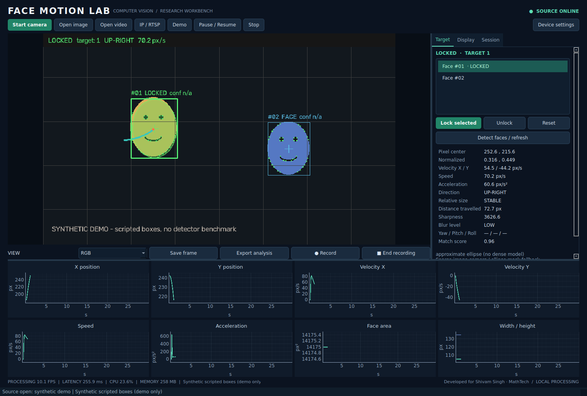
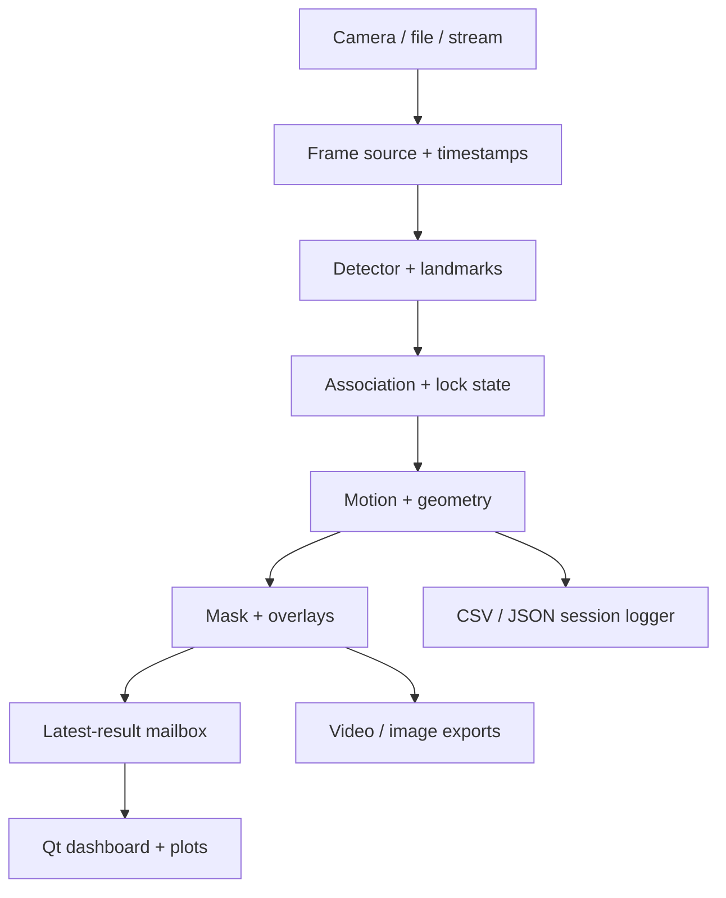

# Face Motion Lab
### Local face tracking, segmentation and movement analysis
**Developed for Shivam Singh · MathTech** · Python 3.11+ · PySide6 · OpenCV

A modular desktop workbench for exploring face motion in webcams, images, videos and supported RTSP/IP streams. Select a face, lock its temporary track, inspect timestamp-based motion and export the measurements. Frames are processed locally; recording is off until explicitly started.



## Start on Windows
1. Install **64-bit Python 3.11 or 3.12** with the Python launcher and pip.
2. Extract the entire ZIP to a writable folder.
3. Double-click **`run_windows.bat`**. It creates a virtual environment, installs dependencies and opens the desktop application. Internet is needed for the first dependency installation.
4. Try **Demo**, then select a subject and click **Lock selected**. Demo detections are scripted and clearly labelled; they are not a face detector benchmark.
5. Click **Start camera** to use your webcam. Camera permission is required.

This is a complete source distribution, not a prebuilt Windows executable. Do not run from inside the compressed ZIP viewer.

## Manual installation (Windows, macOS, Linux)
```bash
python -m venv .venv
```
Windows:
```powershell
.venv\Scripts\activate
```
macOS / Linux:
```bash
source .venv/bin/activate
```
Run from the extracted repository root:
```bash
python -m pip install --upgrade pip
python -m pip install -r requirements.txt
python -m face_motion_lab
```
On macOS/Linux, `bash run_mac_linux.sh` performs the installation and launch. Python 3.11–3.12 are recommended for optional model compatibility; newer Python releases depend on platform wheel availability. A graphical desktop is required for the GUI. Linux may need `libegl1`, `libgl1`, `libgles2` (MediaPipe), `libxkbcommon0` and Qt xcb system libraries such as `libxcb-cursor0`.

## What is implemented
- Camera, image, video, RTSP/HTTP acquisition; camera index, capture resolution and processing width.
- Multiple temporary face IDs, clickable selection, explicit lock/unlock/reset, ambiguity gates and controlled reacquisition.
- Kalman position/velocity/size prediction, forward/backward optical flow and Hungarian appearance/geometry association.
- OpenCV Haar detector without external model downloads; optional MediaPipe Tasks detector and OpenCV YuNet.
- Optional dense MediaPipe facial landmarks. Without that model, actual image corners are labelled **sparse corners**; no anatomical features are invented.
- Pixel and normalized coordinates; top-left, centered downward-Y and Cartesian upward-Y origins.
- Smoothed movement, velocity, vector acceleration magnitude, direction, distance, relative apparent-size trend and eight plots.
- Landmark polygon, convex hull, refined, ellipse and heuristic skin masks; opacity, fill, boundary and six segmentation views.
- RGB, grayscale, Canny/Sobel/Laplacian, three blur effects, binary mask, contrast enhancement, dwell/density/movement maps and simulated night/thermal views.
- Optional approximate solvePnP pose and chessboard camera calibration.
- MP4 recording, streaming CSV and landmarks JSONL, session metadata, PNG/JPEG snapshots, JSON/CSV/plot/mask/trajectory exports and session ZIP/deletion controls.
- Algorithm comparisons, ten runnable notebooks, CLI, automated tests and structured application logging.

### Scope and scientific limits
This is a research workbench, not a validated identity or biometric recognition system. Track IDs refer only to the current source session. Appearance histograms, motion and geometry cannot guarantee identity through crossings, occlusions or drastic lighting changes. Ambiguous matches suspend the lock. After `max_lost_frames`, the original ID stays lost; the operator must explicitly select and lock again. **Never interpret continuity or the association score as identity accuracy.**

Haar is a lightweight frontal-face fallback and can miss rotated or small faces. Dense landmarks, anatomical feature lines and pose require the optional model. The fallback mask is an ellipse; these are geometric masks, not a trained semantic skin parser. The skin threshold is lighting dependent and may perform unevenly across skin tones. Pose uses a generic head model; uncalibrated results are approximate. Bounding-box growth indicates apparent size change, not physical distance. Night/thermal views remap RGB intensity and contain **no infrared or temperature measurements**.

## Desktop workflow
1. Open a source. The status indicator shows online, paused, recording or offline.
2. Select a detected face in the image or list. Press **Lock selected** (shortcut `L`). `U` unlocks; Space pauses/resumes.
3. Use **Display** controls for overlays, masks, landmark modes and filters. Green marks the locked observed target; orange marks a missing target's prediction. Predicted positions are excluded from measured motion.
4. **Device settings** is available while stopped. Set detector/model paths, confidence gates, smoothing, graph window, optical flow and Kalman options. Settings persist at `~/.face-motion-lab/settings.json`.
5. **Record** explicitly creates a folder under `data/sessions/` in the launch directory. **End recording**, Pause, Stop, end of media and application close finalize the session.
6. **Export analysis** creates CSV/JSON, statistics, current frame, mask, landmarks, heatmap, trajectory and eight plots in a timestamped folder. Exported CSV uses processed-frame pixels with a top-left origin.
7. Manage completed recordings under **Session → Recorded sessions**. ZIP export is lossless; deletion asks for confirmation.

Camera FPS/resolution are requests; device drivers can choose different supported settings. Live timestamps use a monotonic clock. Videos use decoder timestamps where available and documented FPS fallback otherwise. Pausing a live camera excludes paused wall time from finite differences on resume. Settings controls do not alter raw detector input.

## Optional MediaPipe models
The default pipeline works without these models. For dense anatomical landmarks:
```bash
python -m pip install -e ".[landmarks]"
python -m face_motion_lab --download-model landmarker
```
Select `models/face_landmarker.task` under **Device settings → Dense landmark model**. The detector can remain Haar. Model downloads are explicit and use upstream public model URLs. A `.sha256` file records downloaded bytes; supply `--sha256 EXPECTED` to enforce an independently verified digest.

For the MediaPipe detector:
```bash
python -m face_motion_lab --download-model detector
python -m face_motion_lab --detector mediapipe --detector-model models/blaze_face_short_range.tflite --landmark-model models/face_landmarker.task --camera 0
```
For YuNet:
```bash
python -m face_motion_lab --download-model yunet
python -m face_motion_lab --detector yunet --detector-model models/face_detection_yunet_2023mar.onnx --camera 0
```
Models are not bundled. If a selected optional model is missing or fails to load, the UI reports the error: select Haar and clear model paths to use the lightweight fallback. It does not silently substitute another detector into an experiment.

PyTorch and ONNX Runtime are optional extras (`.[torch]`, `.[onnx]`). `ModelDetector` accepts explicit preprocessing/output decoding callables; `examples/custom_model_adapter.py` is a complete Nx6 post-NMS adapter. It does not claim to support arbitrary YOLO tensor layouts without model-specific decoding. Built-in detection runs on CPU; the ONNX adapter uses installed runtime providers. There is no mandatory GPU dependency.

## CLI and research runs
```bash
python -m face_motion_lab --help
python -m face_motion_lab --camera 0
python -m face_motion_lab --video input.mp4
python -m face_motion_lab --image image.jpg
python -m face_motion_lab --demo
python -m face_motion_lab --demo --headless --auto-lock --max-frames 210 --record --output data/output/demo
python -m face_motion_lab --video input.mp4 --headless --auto-lock --output data/output/video
python -m face_motion_lab --video input.mp4 --compare --max-frames 300 --output data/output/comparison
```
`--auto-lock` is explicit and selects the first largest visible face for headless experiments. It never silently picks a new face after the locked target expires. `--compare` replays the same source for detector-only, Kalman, flow and combined configurations. Select `--detector mediapipe` to compare those variants with MediaPipe. Compare reports measure availability and processing time, not recognition accuracy.

## Calibration
Capture at least six (preferably 15–25) sharp views of a chessboard at diverse tilts and locations, all at the same resolution. Board dimensions are **inner corners**; square size uses your chosen real-world unit.
```bash
python -m face_motion_lab --calibrate data/input/chessboard --board-columns 9 --board-rows 6 --square-size 25 --output data/output/calibration
```
Load the resulting `calibration.json` in Device settings. Intrinsics are scaled to the processing resolution and distortion is passed to solvePnP. Calibration improves projection geometry; generic facial dimensions still do not establish absolute subject distance.

## Notebooks and testing
```bash
python -m pip install -e ".[dev,research]"
python -m pytest -q
python -m jupyterlab notebooks
```
Ten notebooks cover detection, landmarks, coordinate tracking, Kalman filtering, movement, segmentation, display transforms, heatmaps, pose and end-to-end experiments. They run without external face photographs using labelled synthetic examples; optional real-image/model experiments are described explicitly.

See [validation.md](docs/validation.md) for the actual checks and environment used for this release. Physical cameras and network cameras need testing on the destination machine.

## Architecture

The Qt main thread only renders UI state. One QThread owns acquisition, processing and recording. A command queue serializes mutations; a one-slot result mailbox prevents a queue of stale GUI frames. The processing engine has no Qt imports and is reusable in tests, CLI and notebooks. Original frames are kept separate from visualization transforms.

## Configuration, measurement and history
- `configs/default.yaml` lists every persisted option; `configs/development.yaml` provides a lighter processing setup.
- `smoothing_factor`: 1 means no EMA smoothing; smaller values reduce jitter with lag.
- `tracking_confidence`: threshold on a heuristic association score, not calibrated probability.
- Trail 0 means unlimited; long unlimited sessions can consume memory. Graph/measurement history is capped at `history_limit` (default 20,000 rows). Graph rendering uses the latest 2,000 observations. Recording writes every processed analytics row to disk.
- Locking a new target resets that target's motion/plots/statistics. Previously processed CSV rows remain available until the history limit or explicit Reset. Source frame counts are source-wide. Statistics distinguish target observations and source duration.
- Movement through unobserved intervals is unknown and excluded; total distance is the sum of observed smoothed displacement, not a complete physical path.
- Recording video is resampled to constant FPS with held frames; analytics preserve source timestamps. Gaps above ten seconds are flagged and compressed in video timing.

## Troubleshooting
| Symptom | Action |
|---|---|
| Camera cannot open | Close other camera apps, allow OS camera permissions and try camera index 1. |
| No detected face | Improve frontal lighting, increase processing resolution, or select MediaPipe/YuNet. Haar has no calibrated confidence value. |
| Lock becomes orange/lost | Keep the same subject visible; if loss expires or an overlap is ambiguous, explicitly reselect and lock. |
| Dense landmarks / pose absent | Install the optional extra, download the `.task` model and set its path. On Linux, install the required EGL/GLES libraries. Sparse corners cannot provide pose. |
| RTSP fails | Verify credentials, camera codec and network reachability. FFmpeg support and the camera server determine compatibility. |
| Linux Qt platform error | Install the distro's Qt/xcb/EGL support packages. Headless analytics can run without a display. |
| MP4 cannot be opened | Verify the installed OpenCV FFmpeg build supports MPEG-4 and choose a writable output location. |
| Preview is slow | Lower processing width, disable dense landmarks/mesh and optical flow, or use simpler display modes. |
| Settings prevent startup | Rename `~/.face-motion-lab/settings.json`, or launch with `--config configs/default.yaml`. |
| pip model conflicts | Use a fresh virtual environment. Avoid mixing multiple OpenCV distributions in an existing environment. |

Logs rotate under `~/.face-motion-lab/app.log`. The app does not save stream URLs in session metadata. Cameras are started visibly and recording is opt-in. Exported data stays on disk until you delete it.

## Documentation and future work
See [architecture](docs/architecture.md), [algorithms](docs/algorithms.md), [tracking](docs/tracking.md), [segmentation](docs/segmentation.md), [motion](docs/movement_analysis.md), [visualization](docs/visualization.md), [performance](docs/performance.md) and [coverage](docs/feature_coverage.md).

Research uses include HCI experiments, visualization education and reproducible tracker comparisons. Future development can add sensor-specific radiometric inputs, dataset-ground-truth identity metrics, semantic face parsing and hardware-specific deployment tuning. These are not claimed as current features.

## License
Application source is MIT licensed. Dependencies and externally downloaded models retain their respective licenses. See [THIRD_PARTY.md](THIRD_PARTY.md).
